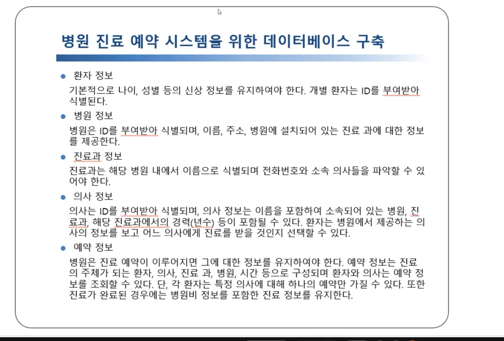
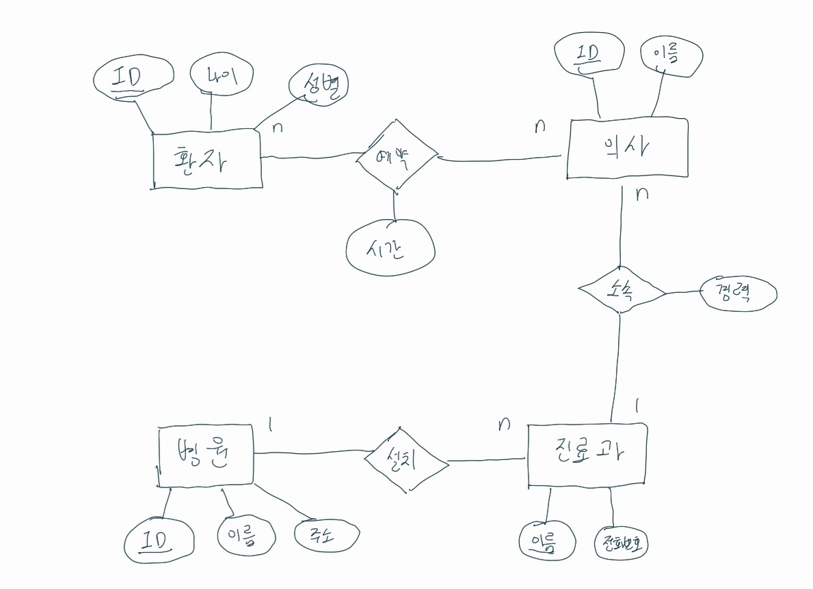
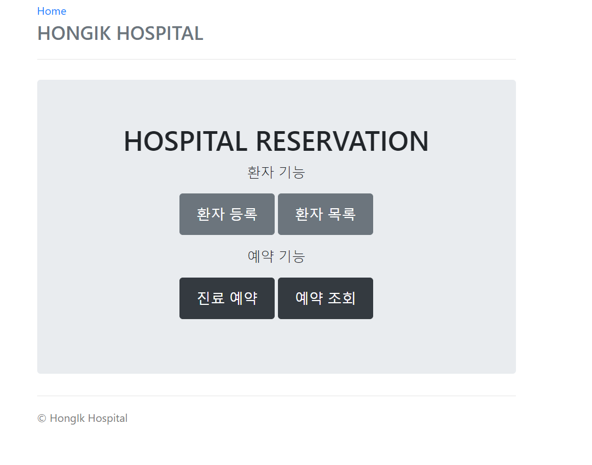
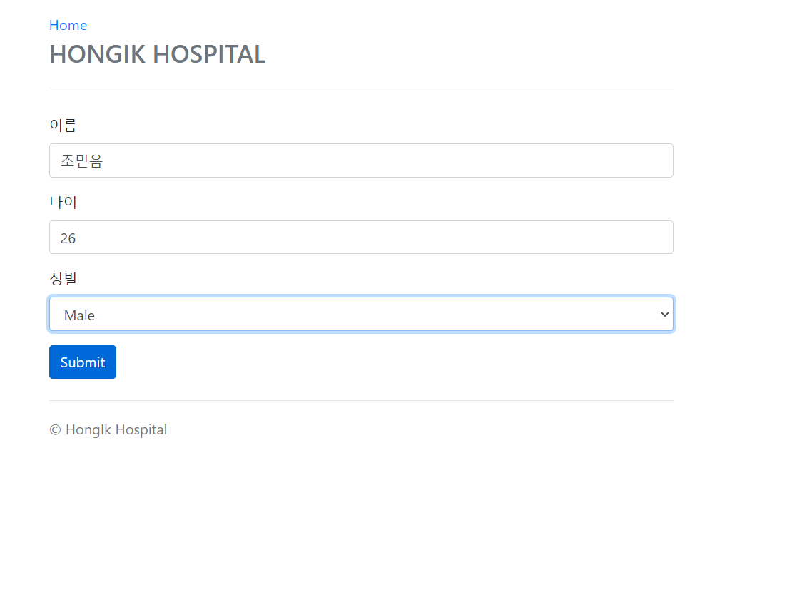
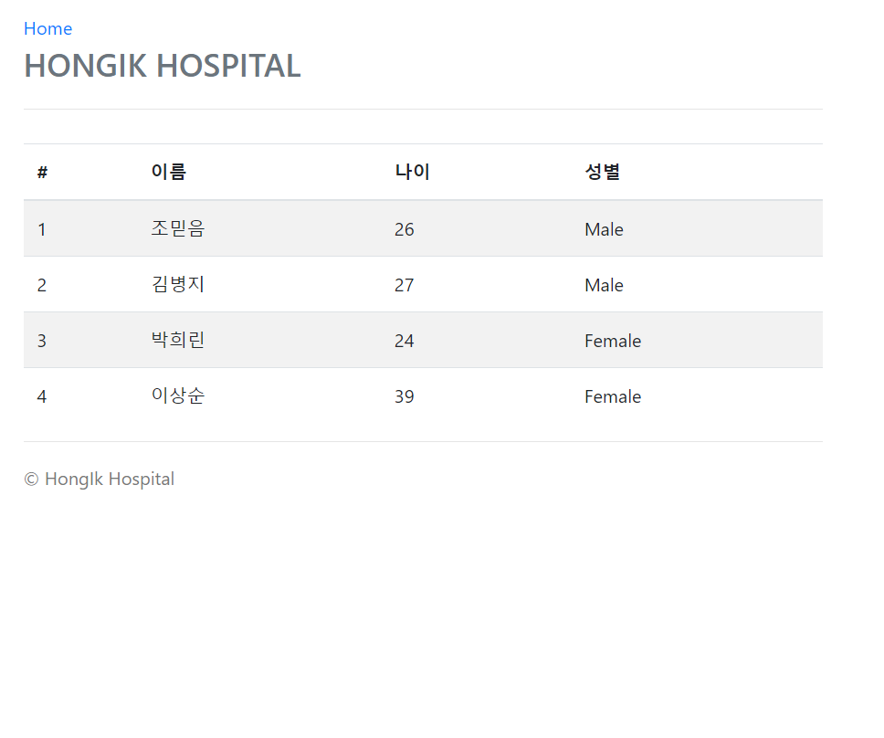
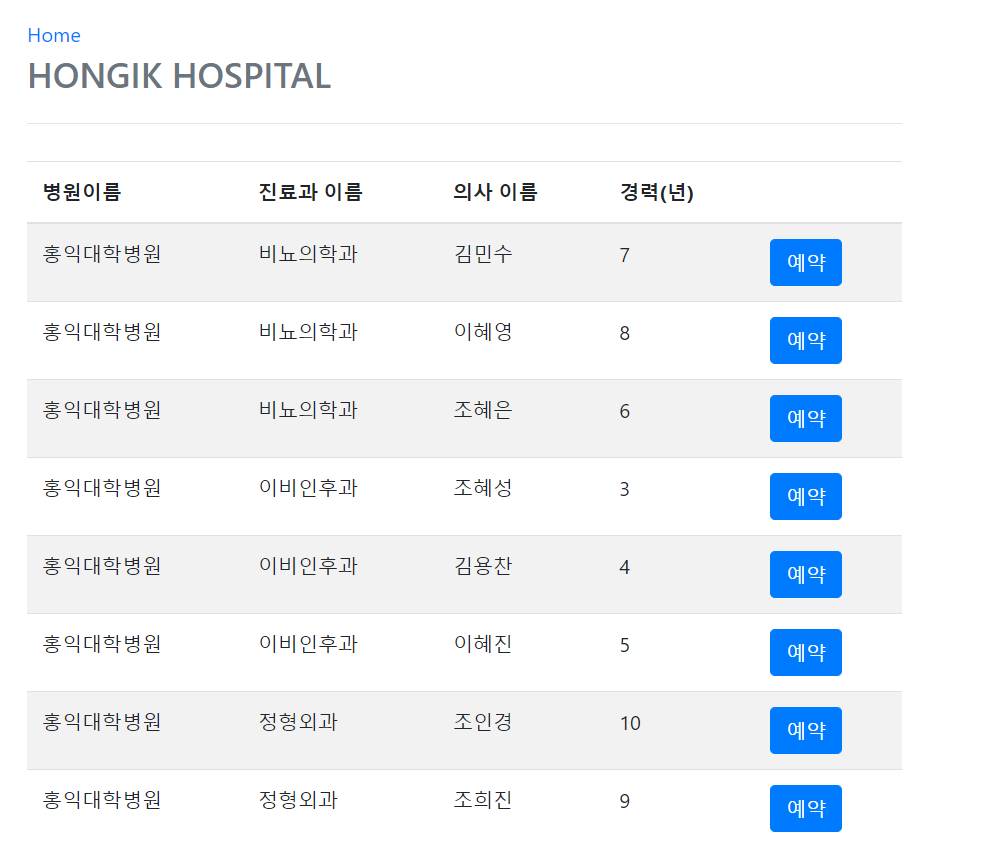
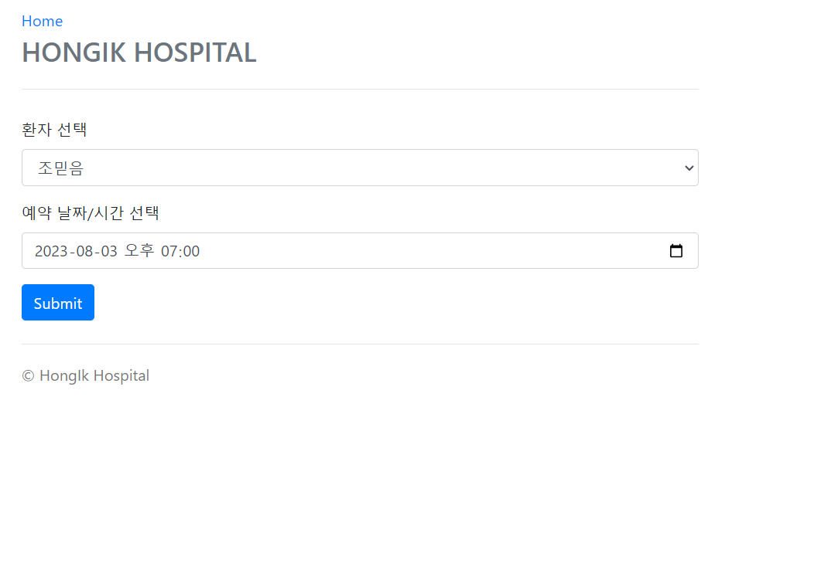
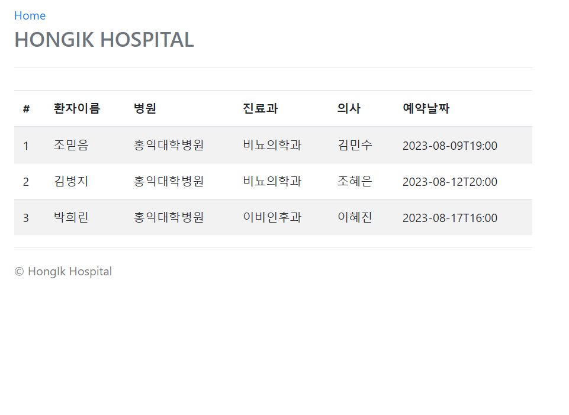

# 병원 진료 예약 시스템
JPA를 활용해 만든 간단한 병원 진료 예약 사이트

## 요구사항

## E-R 다이어그램

## 기능
### 메인 홈 화면

원하는 메뉴의 버튼을 클릭하여 해당 기능을 사용합니다.
### 환자 등록

환자의 정보를 입력하여 환자를 등록할 수 있습니다.
### 등록된 환자 조회

등록된 모든 환자들의 리스트를 조회할 수 있습니다.
### 진료 예약

등록되어 있는 병원, 진료과, 의사에 대한 정보들이 출력됩니다. 예약을 원하는 의사를 선택하여 예약할 수 있습니다.

예약을 원하는 환자를 선택하고, 예약 날짜를 선택해 예약합니다.
### 예약 조회

등록된 모든 예약 리스트들 조회할 수 있습니다.
